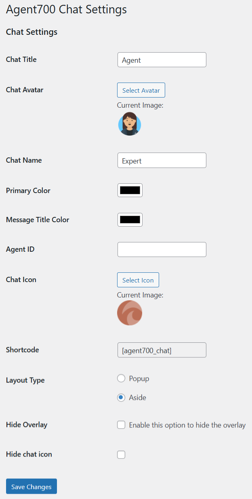
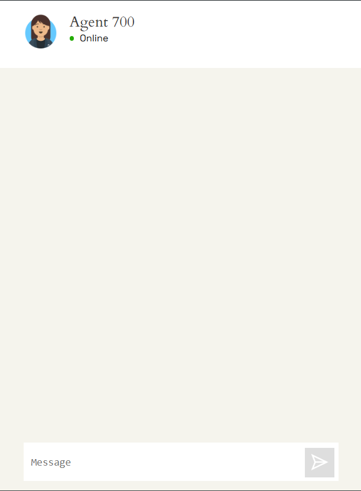

# AGENT 700 AI CHAT PLUGIN #

This is a plugin for Wordpress which generates a connection interface between the user and the chat.

### How do I get set up? ###

Copy the Agent700 plugin folder to the following location in your Wordpress:

``/wp-content/plugins/folder-agent700-here`` 

### How to config plugin? ###

The plugin has some fields required for successful connection with the AI ​​and other fields that allow for visual customization.

### Steps for configuring the plugin ###

Once the plugin is installed and activated from the WordPress plugins section, you can find it in the admin: Settings > Agent700 Chat

On the configuration screen you will have the following fields:

| Field               | Description                                             | Required | Default value                    |
|---------------------|---------------------------------------------------------|----------|----------------------------------|
| Chat Title          | Change chat header title                                | -        | Agent 700                        |
| Chat Avatar         | Change header image of chat                             | -        | Default image                    |
| Chat Name           | Change the name of chat (how appear in chat bubble)     | -        | Expert                           |
| Primary Color       | Change color of send button and scrollbar               | -        | #000000                        |
| Message Title Color | Change color of message title. (chat messages and user) | -        | #000000                        |
| Agent ID            | Provided by Agent 700                                   | Yes      | Empty                            |
| Chat Icon           | Change chat icon                                        | -        | Default image                    |
| Shortcode           | Shortcode                                               | No       | [agent700_chat]                  |
| Layout type         | Select layout type. Available only in popup layout      | -        | Aside                            |
| Hide overlay        | Hide chat overlay                                       | -        | Uncheck                          |
| Hide chat icon      | Hide bubble icon on site                                | -        | Uncheck                          |

  
### Settings preview: 

  
### Chat preview: 
